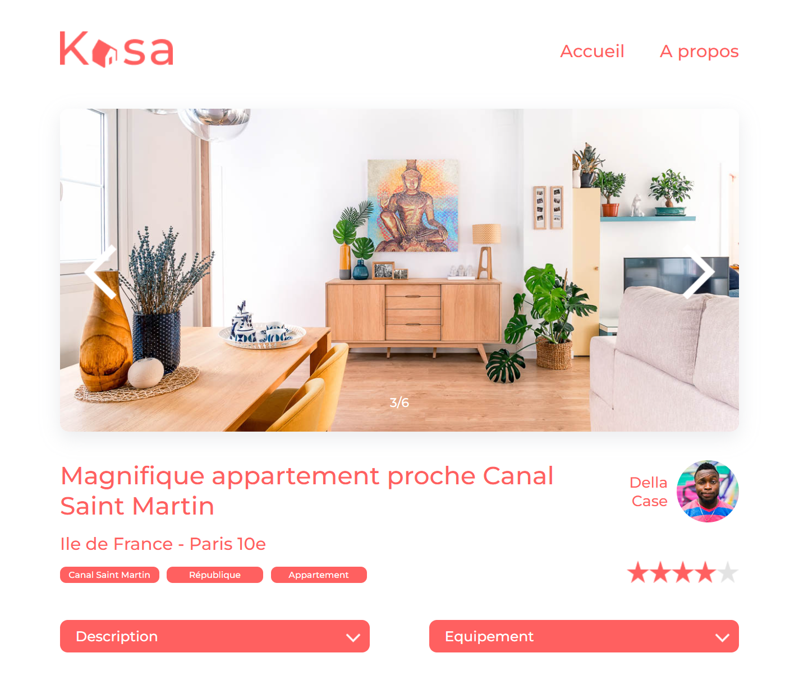

# Kasa - Application de location d'appartements (React)

Refonte totale d'un site de location d'appartements entre particuliers, en passant d'une ancienne stack ASP.NET à une application moderne en **React** et **React Router**.

## 📖 Contexte du projet

Kasa fait partie des leaders de la location d'appartements entre particuliers en France. Le site existant, codé il y a plus de 10 ans, nécessitait une refonte complète. Ma mission en tant que développeur Front-End freelance a été de développer la nouvelle plateforme web en suivant des maquettes Figma strictes.

## 🎯 Compétences validées

- **Développement de composants React** : Création de composants réutilisables (Header, Footer, Gallery, Collapse, Cards...).
- **Routage avancé** : Configuration de la navigation entre les pages de l'application avec **React Router** (gestion des paramètres d'URL et de la page 404).
- **Gestion du State et des Props** : Manipulation de l'état local et transfert de données entre composants parents et enfants.
- **Intégration UI/UX** : Respect fidèle des maquettes Figma, avec une approche full responsive (SASS/SCSS).

## 🛠️ Technologies utilisées

- React.js (Create React App / Vite)
- React Router DOM
- SASS / SCSS
- Node.js (Environnement)

## 🎓 Soutenance du projet

Vous pouvez consulter le support de présentation expliquant mon architecture de composants React, la gestion du routage, et mes choix d'intégration :

[📄 Voir le support de présentation (PDF)](./presentation-kasa.pdf)

## 💻 Installation locale

Pour lancer ce projet localement sur votre machine :

### 1. Cloner le dépôt

`git clone https://github.com/Chaimaa-as/Kasa.git`

### 2. Installer les dépendances

Dans le terminal, à la racine du projet, lancez :
`npm install`

### 3. Lancer l'application

`npm start` (ou `npm run dev`)
L'application s'ouvrira automatiquement sur `http://localhost:3000/`.
